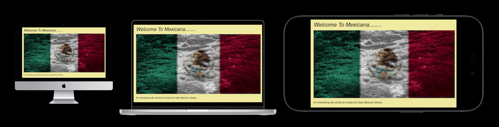

# 🌮 **Mexicana – Recipe Web Application**




Mexicana is a full-stack recipe management application that allows users to explore, create, edit and store Mexican-inspired food recipes. The site features user accounts, CRUD functionality, category filtering, Materialize UI, and a clean responsive layout.

This project was built using **Flask**, **MongoDB**, **Materialize CSS**, and is deployed on **Heroku**.

------

## 📖 **Table of Contents**

1. Project Overview

User Experience (UX)

Features

Technologies Used

Database Structure

Screenshots

Testing

Deployment (Heroku)

Future Improvements

Credits

------

# 📝 **Project Overview**

Mexicana is a recipe management platform where users can:

- Create an account
- Log in and manage recipes
- Browse recipes by category
- Add new recipes using a simplified form
- Edit or delete their own recipes
- View recipes created by all users
- Interact with a welcoming, friendly UI themed around Mexican cuisine

The site provides a modern, responsive, mobile-first interface using Materialize CSS.

------

# 🎯 **User Experience (UX)**

## **Target Audience**

- Home cooks interested in Mexican recipes
- People who want to store personal recipes online
- Food enthusiasts looking for new ideas
- Users who want a simple, clean recipe manager

## **User Stories**

### 🚶 Visitor / Unregistered User

- View the homepage / hero
- Browse all recipes
- Filter recipes
- View categories
- Register an account

### 👤 Registered User

- Log in
- Create a profile
- Add new recipes
- Edit existing recipes
- Delete their own recipes
- Upload images
- Log out safely

------

# ✨ **Features**

### ✔ Authentication & User Management

- User registration
- User login
- User logout
- User profile page

### ✔ Recipe CRUD Functionality

- Add new recipes
- Edit existing recipes
- Delete recipes
- View all recipes

### ✔ Filtering & Categories

- Course dropdown (Starter / Main / Dessert)
- Filter recipes by course
- Search recipes (name, ingredients, etc.)

### ✔ UI & Layout

- Responsive design
- Materialize CSS UI components
- Hero section on home page
- Modal welcome popup
- Sidenav navigation for mobile
- Card-based recipe layout

### ✔ Media Support

- Upload recipe images (or use URLs)

### ✔ Static Pages

- Home page
- View recipes page

------

# 🛠 **Technologies Used**

### **Frontend**

- HTML5
- CSS3
- Materialize CSS
- JavaScript
- jQuery

### **Backend**

- Python
- Flask
- Jinja2 templating

### **Database**

- MongoDB (Atlas)
- Collections:
  - `users`
  - `recipes`
  - `courses`

### **Deployment**

- Heroku (Gunicorn)

------

# 🗃 **Database Structure**

### `users` collection

```

{
  "_id": ObjectId,
  "username": "mark",
  "password": "hashedpassword"
}
```

### `recipes` collection

```

{
  "_id": ObjectId,
  "course_name": "Starter",
  "recipe_name": "Tacos",
  "ingredients_list": "List...",
  "method_list": "Steps...",
  "cook_time": "20 mins",
  "serves": "2",
  "created_by": "mark",
  "image_url": "/static/images/taco1.jpg"
}
```

### `courses` collection

```

{
  "_id": ObjectId,
  "recipe_course": "Starter"
}
```

------

# 🖼 **Screenshots**

*Add your screenshots here once ready:*

- Home page
- Hero section
- Recipes list
- Add recipe form
- Login / Register pages
- Profile
- Mobile view

Example placeholder:

```

![Screenshot] (static/wires/screen.png)
```

------

# 🧪 **Testing**

### ✔ Manual Testing

- All links tested
- Forms validated
- Navigation works on all device sizes
- CRUD functions verified
- User login / logout / registration tested
- MongoDB writes confirmed
- Materialize components tested (modal, sidenav, selects)

### ✔ Validator Testing

- HTML validated via W3C
- CSS validated
- Python validated with Flake8